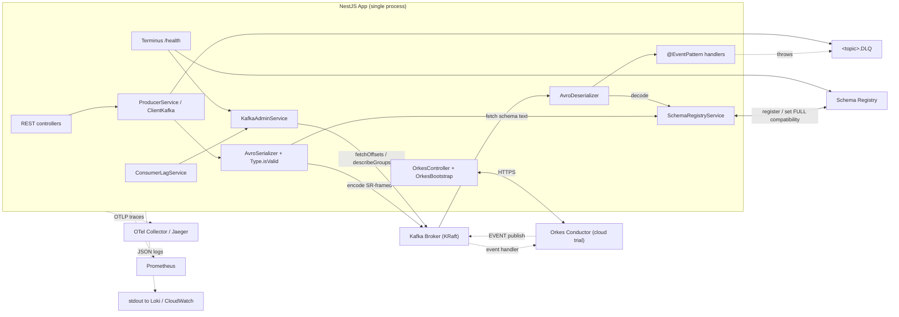

# Architecture

## Key decisions

- **`@confluentinc/schemaregistry` over the older `@kafkajs/confluent-schema-registry`** — first-party, supports modern compatibility / migration features.
- **Native NestJS `Transport.KAFKA` + custom `AvroSerializer`/`AvroDeserializer`** — instead of hand-rolled `kafkajs` + decorator discovery. Same DLQ + retry semantics, fewer moving parts.
- **`Type.isValid` pre-encode validation** (BTH guideline §4) — the Avro lib (`avsc`) parses each `.avsc` once at first use and runs `isValid` before SR encode. Bad payloads fail with field paths and never hit the broker.
- **`FULL` compatibility default** (guideline §6) — applied per subject after registration. Allows only optional add/delete without coordinated rollout.
- **Topic naming** `{ORG}-{APP}-{ENV}-{FEATURE}-{TYPE}` env-driven — same code, different topics per env. Filename uses `_` because `.` in Kafka topic names already has meaning.
- **Schemas live in this repo** — no separate `om-schema-registry` repo, no AsyncAPI export, no CI registration step. `SchemaRegistryService` registers everything at boot.
- **Orkes Conductor as a separate concern** — `OrkesModule` is gated by `ORKES_ENABLED`. The bootstrap service registers workflow + event-handler JSON files on startup when `ORKES_AUTO_REGISTER=true`.
- **DLQ preserves original bytes** — no re-encode. Downstream tooling can replay using `x-original-topic`.
- **Poison pill isolation** — decode failures never block the partition; they go straight to DLQ.

## Trade-offs

| Choice | Trade-off |
|---|---|
| `kafkajs` (pure JS) | Slower than librdkafka under very high throughput, but far simpler and CI-friendly on Linux + macOS + ARM. |
| Auto-registration of schemas on boot | Nice DX for dev. For production, prefer `pnpm register:schemas` as a one-shot in CD and disable the boot path if strict schema governance is required. |
| `Type.isValid` runs on top of SR encode | Two parses of the schema (once locally, once by SR). Keeps catastrophic shape errors out of the SR error stream and gives precise field paths. |
| Single in-process retry | Blocks the partition for up to `sum(backoffMs) * numFailedMessages`. Acceptable for most workloads; introduce a retry-topic ladder only if needed. |
| Orkes Cloud trial vs self-hosted | Cloud trial is free + fast to demo, but requires a tunnel back to a local Kafka. For private deployments, run Conductor self-hosted in the same VPC. |
| Orkes events bypass FULL compatibility | Per BTH §5: Orkes Event tasks only see the latest schema version, so a change there effectively skips compatibility checks. Treat schema changes touched by an Orkes path with extra care. |
