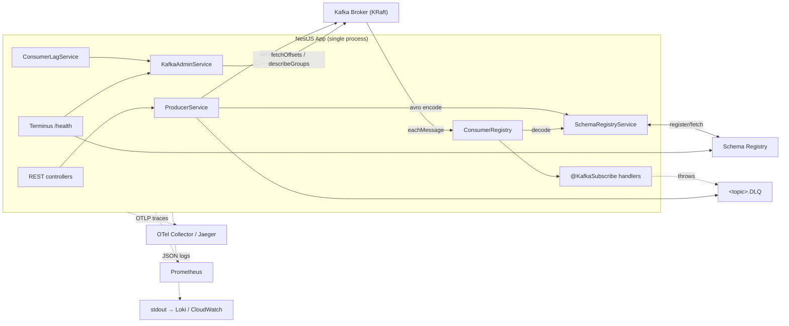

# Architecture

## Key decisions

- **kafkajs over `@nestjs/microservices` Kafka transport** — the built-in transport wraps kafkajs but exposes no hook for Schema Registry serialization. We want full control of encode/decode so we use kafkajs directly.
- **Decorator-driven subscription** — `@KafkaSubscribe` keeps handlers close to the feature module, not wired up centrally. `DiscoveryService` finds them at boot.
- **One consumer per `groupId`** — the registry groups subscribers by `groupId` and creates a single `Consumer` that subscribes to all its topics. This matches Kafka semantics (a group is a unit of load balancing).
- **DLQ preserves original bytes** — we do not re-encode. Downstream DLQ tooling can read the original `x-original-topic` and replay.
- **Poison pill isolation** — decode failures never block the partition; they go straight to DLQ after zero handler attempts.
- **Retry is in-process and finite** — exponential backoff up to `maxAttempts`, then DLQ. No pause/resume dance, no off-box retry topic. Keeps the mental model simple; add a retry-topic ladder only if workload demands it.

## Trade-offs

| Choice | Trade-off |
|---|---|
| kafkajs (pure JS) | Slower than librdkafka under very high throughput, but far simpler and CI-friendly on Linux + macOS + ARM. |
| Auto-registration of schemas on boot | Nice DX for dev; for production, prefer a CI step (`pnpm register:schemas`) and disable `onModuleInit` path if strict schema governance is required. |
| Single in-process retry | Blocks the partition for up to `sum(backoffMs) * numFailedMessages`. Acceptable for most workloads, but inadequate if handler latency is high or throughput is huge — then introduce a retry topic with delay-and-reconsume. |
