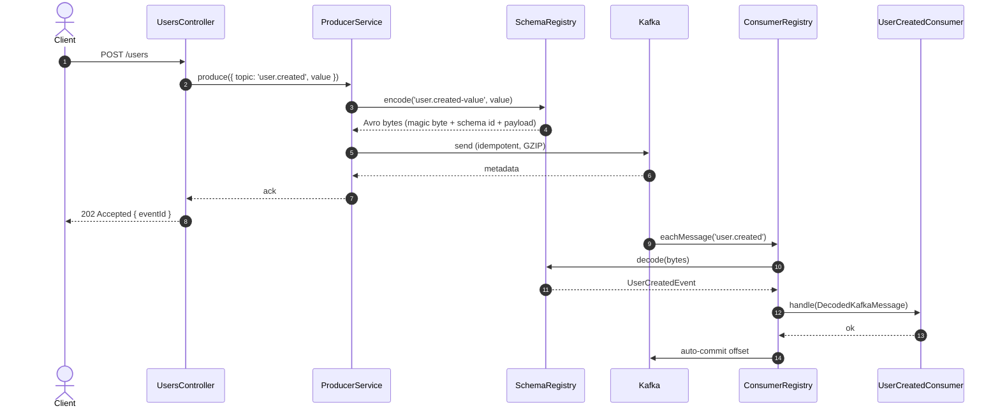
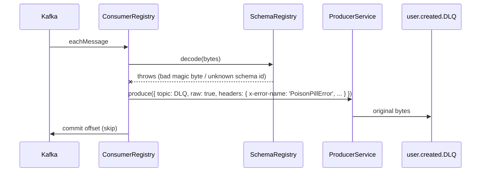

# Produce / Consume flow (UserCreated)



## Failure paths

### Decode failure (poison pill)



### Handler exhaustion

```mermaid
sequenceDiagram
  participant REG as ConsumerRegistry
  participant HND as Handler
  participant PROD as Producer
  participant DLQ as &lt;topic&gt;.DLQ

  loop up to maxAttempts
    REG->>HND: handle
    HND--xREG: throws
    REG->>REG: sleep backoffMs[attempt]
  end
  REG->>PROD: produce(DLQ, headers: { x-error-name: 'HandlerExhaustedError', x-attempts: N })
  REG->>KAFKA: commit offset
```

## Subject naming

Default is `TopicNameStrategy`: subject is `<topic>-value`.

- Filename `user-created.avsc` → topic `user.created` → subject `user.created-value`.
- To change the convention, override `ProducerService.produce({ subject: '...' })` per call, or edit `SchemaRegistryService.subjectForFile`.
