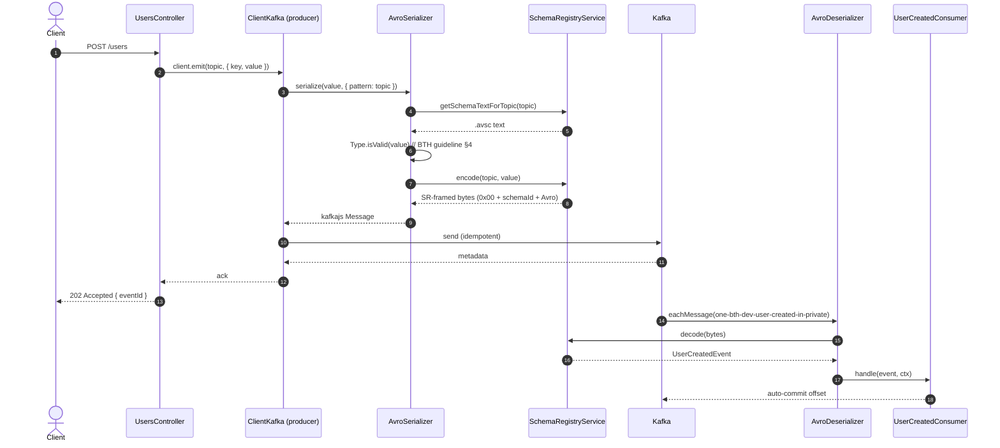

# Produce / Consume flow

## REST -> Kafka -> Consumer (UserCreated)



## Failure paths

### Pre-encode validation failure (Type.isValid)

```mermaid
sequenceDiagram
  participant REST as UsersController
  participant SER as AvroSerializer
  participant SR as SchemaRegistry

  REST->>SER: serialize(badPayload)
  SER->>SR: getSchemaTextForTopic(topic)
  SR-->>SER: .avsc text
  SER->>SER: Type.isValid(badPayload)  // false; collects paths
  SER--xREST: throw SchemaPayloadInvalidError(topic, paths)
  Note over REST: Never reaches SR.encode<br/>or the broker
```

### Decode failure (poison pill)

```mermaid
sequenceDiagram
  participant KAFKA as Kafka
  participant DES as AvroDeserializer
  participant SR as SchemaRegistry
  participant FILT as KafkaDlqFilter
  participant DLQ as &lt;topic&gt;.DLQ

  KAFKA->>DES: eachMessage
  DES->>SR: decode(bytes)
  SR--xDES: throws (bad magic byte / unknown schema id)
  DES--xFILT: rethrow
  FILT->>DLQ: produce(raw original bytes, headers)
```

### Handler exhaustion

```mermaid
sequenceDiagram
  participant DES as AvroDeserializer
  participant HND as Handler
  participant INT as KafkaRetryInterceptor
  participant FILT as KafkaDlqFilter
  participant DLQ as &lt;topic&gt;.DLQ

  loop up to maxAttempts
    DES->>INT: invoke
    INT->>HND: handle
    HND--xINT: throws
    INT->>INT: sleep backoffMs[attempt]
  end
  INT--xFILT: HandlerExhaustedError(attempts)
  FILT->>DLQ: produce(headers: x-error-name, x-attempts, ...)
```

## Orkes -> Kafka -> Orkes loop

```mermaid
sequenceDiagram
  actor Operator
  participant CTL as OrkesController
  participant ORKES as Orkes Cloud
  participant KAFKA as Kafka
  participant HND as OrderPlacedConsumer (Nest)

  Operator->>CTL: POST /orkes/test-workflow
  CTL->>ORKES: startWorkflow(kafka_demo_workflow)
  ORKES->>ORKES: INLINE buildPayload
  ORKES->>KAFKA: EVENT publish (sink: kafka:&lt;topic&gt;)
  KAFKA->>HND: eachMessage
  HND-->>KAFKA: auto-commit
  KAFKA->>ORKES: event handler order_placed_handler fires
  ORKES->>ORKES: startWorkflow(kafka_demo_consumer_workflow)
  ORKES-->>CTL: workflowId
  CTL-->>Operator: 202 { workflowId }
```

## Subject naming

Default is `TopicNameStrategy`: subject is `<topic>-value`.

- Filename `one_bth_dev_user_created_in_private.avsc` -> topic `one-bth-dev-user-created-in-private` -> subject `one-bth-dev-user-created-in-private-value`.
- The conversion is "strip path, replace `_` with `-`, append `-value`"; see `SchemaRegistryService.subjectForFile`.
